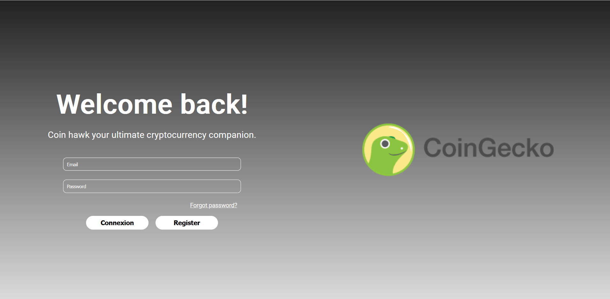
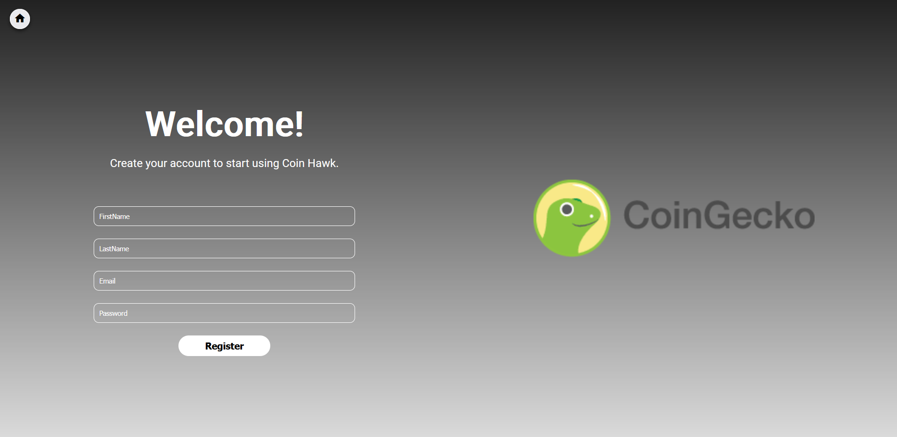
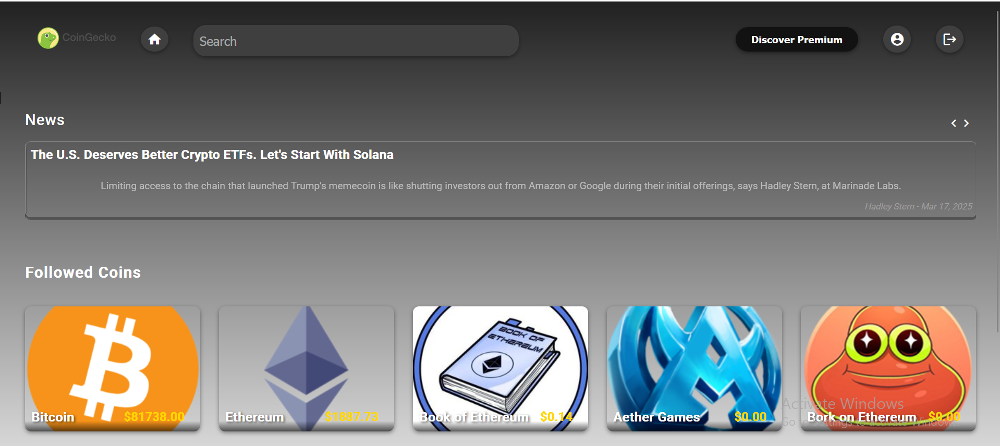
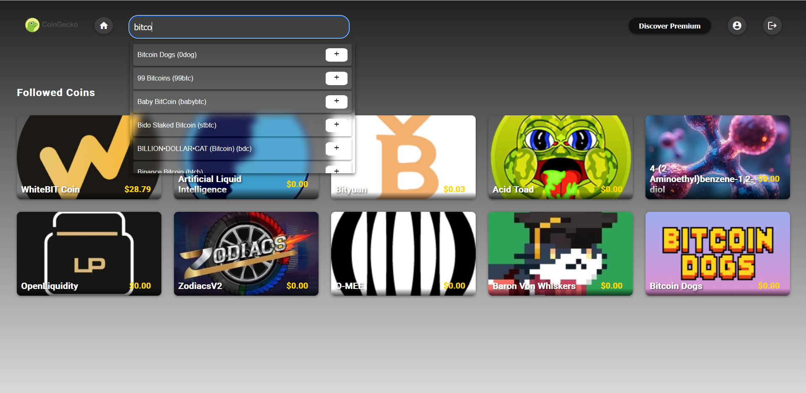
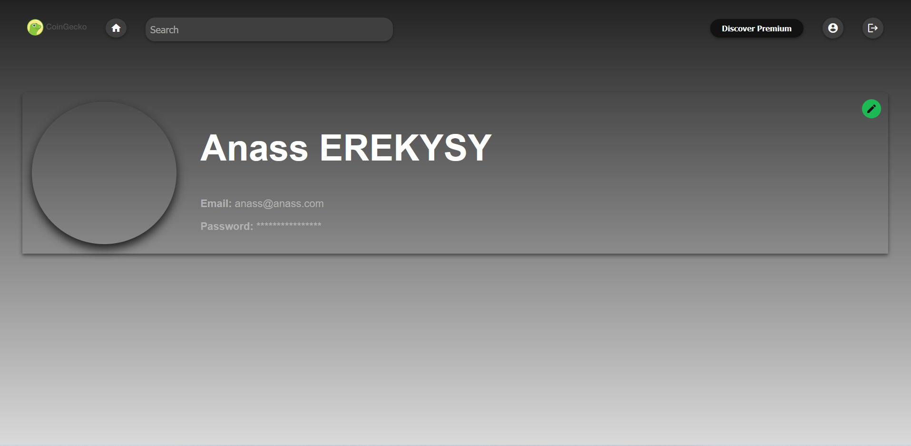
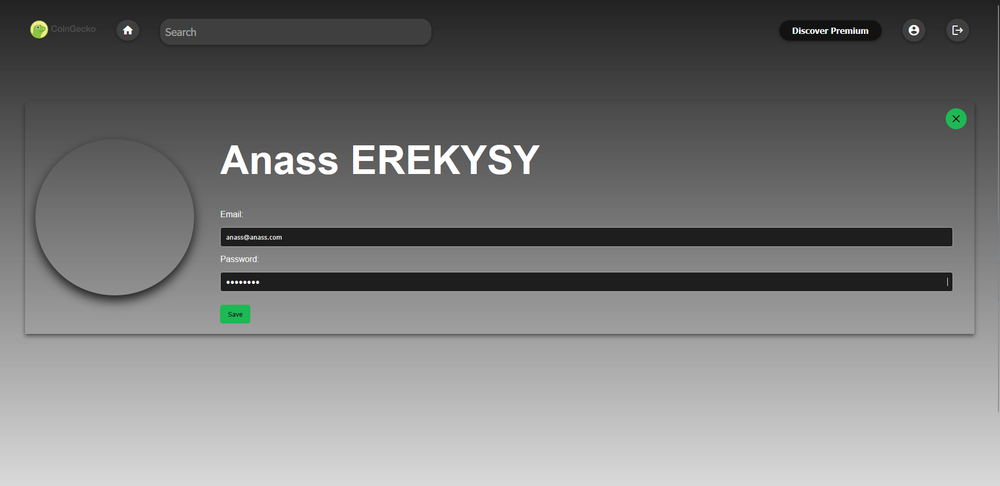
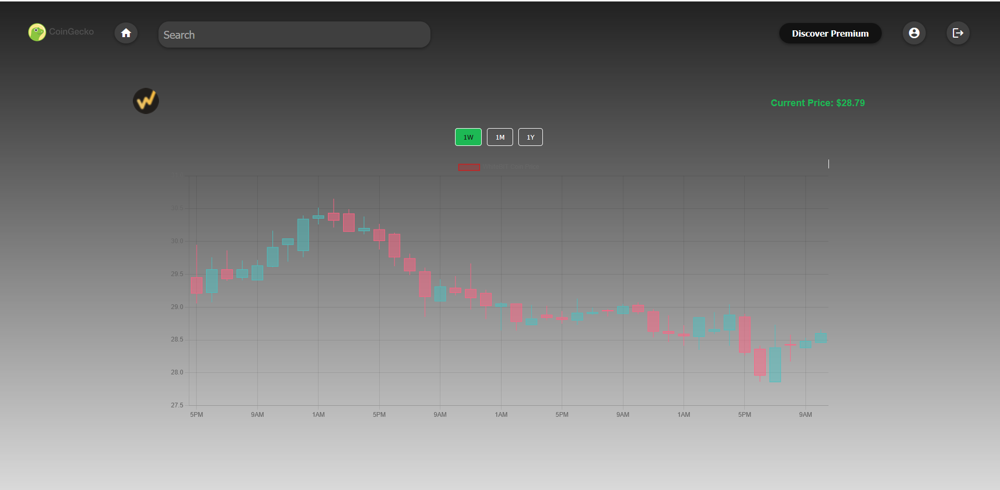

# CoinHawk

CoinHawk is a cutting-edge cryptocurrency  platform that delivers real-time market insights to empower your investment decisions.
Designed for traders of all levels.

## Stack

1. Frontend: Angular 19

2. Backend: .NET 8 Web API

3. Database: SQL Server (Dockerized)

4. Cache: Redis (Dockerized)

5. Authentication: KeyCloak (Dockerized)

6. External APIs : CoinGeko and News APIs


### Features

1. Login: 
    

2. Register: 
    

3. DashBoard : 
    
    

4. User Profile: 
    
    
    View user profile details.

5. Coin Details: 
    

## Getting Started
Follow these steps to set up and run the application locally.


Prerequisites  
Ensure you have the following installed on your system:

1. Node.js (LTS recommended)

2. Angular CLI

3. .NET 8 SDK

4. Clone the project to your local machine:

```bash
git clone https://github.com/AnassEREKYSY/CoinHawk.git
cd CoinHawk
```

Backend Setup

Navigate to the API directory:
```bash
cd server/API
```

Restore dependencies::
```bash
dotnet restore
```

Run the API:
```bash
dotnet run
```


Frontend Setup

Navigate to the client directory:
```bash
cd client
```

Install dependencies:
```bash
npm install
```

Run the Angular development server:
```bash
npm start 
or 
ng serve
```

Open your browser and go to:
```bash
http://localhost:4200/
```
# CoinHawk